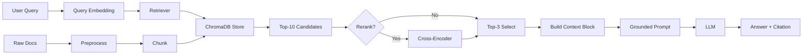

# Architecture — RAG Pipeline (Day 08 Lab)

## 1. Tổng quan kiến trúc

```
[Raw Docs]
    ↓
[index.py: Preprocess → Chunk → Embed → Store]
    ↓
[ChromaDB Vector Store]
    ↓
[rag_answer.py: Query → Retrieve → Rerank → Generate]
    ↓
[Grounded Answer + Citation]
```

**Mô tả ngắn gọn:**
> Nhóm xây dựng một hệ thống hỏi đáp nội bộ (RAG – Retrieval-Augmented Generation) cho tài liệu doanh nghiệp, giúp nhân viên nhanh chóng tra cứu chính sách, quy trình và FAQ. Hệ thống phục vụ nhân viên, IT, HR và các bộ phận khác, giải quyết vấn đề tìm kiếm thông tin phân tán, khó truy cập và tốn thời gian. Người dùng chỉ cần đặt câu hỏi tự nhiên và nhận câu trả lời chính xác kèm trích dẫn từ tài liệu gốc.

---

## 2. Indexing Pipeline (Sprint 1)

### Tài liệu được index
| File | Nguồn | Department | Số chunk |
|------|-------|-----------|---------|
| `policy_refund_v4.txt` | policy/refund-v4.pdf | CS | 6 |
| `sla_p1_2026.txt` | support/sla-p1-2026.pdf | IT | 5 |
| `access_control_sop.txt` | it/access-control-sop.md | IT Security | 7 |
| `it_helpdesk_faq.txt` | support/helpdesk-faq.md | IT | 6 |
| `hr_leave_policy.txt` | hr/leave-policy-2026.pdf | HR | 6 |

### Quyết định chunking
| Tham số | Giá trị | Lý do |
|---------|---------|-------|
| Chunk size | 500 tokens | Max context length của model embed (https://huggingface.co/google/embeddinggemma-300m) là 2048 -> Chọn 500 tokens để có thể bao hàm hầu hết context của các thông tin hiện tại (Policy, FAQ, SOP) ít nhiễu |
| Overlap | 80 tokens | Sẽ đủ để các chunk không bị mất phần đầu, phần cuối giúp query không bị đứt đoạn |
| Chunking strategy | Heading-based | Vì tài liệu có cấu trúc rất rõ, chunk theo heading sẽ giữ lại được thông tin rất tốt. Nếu 1 chunk quá dài thì giới hạn theo chunk size |
| Metadata fields | source, section, effective_date, department, access | Phục vụ filter, freshness, citation |

### Embedding model
- **Model**: embeddinggemma-300m (local)
- **Vector store**: ChromaDB (PersistentClient)
- **Similarity metric**: Cosine

---

## 3. Retrieval Pipeline (Sprint 2 + 3)

### Baseline (Sprint 2)
| Tham số | Giá trị |
|---------|---------|
| Strategy | Dense (embedding similarity) |
| Top-k search | 10 |
| Top-k select | 3 |
| Rerank | Không |

### Variant 1 + 2 (Sprint 3)
| Tham số | Giá trị | Thay đổi so với baseline |
|---------|---------|------------------------|
| Strategy | Sparse/Hybrid | Dense |
| Top-k search | 10 | 10 |
| Top-k select | 3 | 3 |
| Rerank | False (cross-encoder / MMR) | False |
| Query transform | Giữ nguyên Query gốc | Giữ nguyên Query gốc | 

**Lý do chọn variant này:**
> Chọn tune strategy thành sparse và hybrid vì corpus có cả câu tự nhiên (policy) lẫn mã lỗi và tên chuyên ngành (SLA ticket P1, ERR-403).

---

## 4. Generation (Sprint 2)

### Grounded Prompt Template
```
Answer only from the retrieved context below.
If the context is insufficient to answer the question, say you do not know and do not make up information.
Cite the source field (in brackets like [1]) when possible.
Keep your answer short, clear, and factual.
Respond in the same language as the question.

Question: {query}

Context:
{context_block}

Answer:
```

### LLM Configuration
| Tham số | Giá trị |
|---------|---------|
| Model | gpt-4o-mini |
| Temperature | 0 (để output ổn định cho eval) |
| Max tokens | 512 |

---

## 5. Failure Mode Checklist

> Dùng khi debug — kiểm tra lần lượt: index → retrieval → generation

| Failure Mode | Triệu chứng | Cách kiểm tra |
|-------------|-------------|---------------|
| Index lỗi | Retrieve về docs cũ / sai version | `inspect_metadata_coverage()` trong index.py |
| Chunking tệ | Chunk cắt giữa điều khoản | `list_chunks()` và đọc text preview |
| Retrieval lỗi | Không tìm được expected source | `score_context_recall()` trong eval.py |
| Generation lỗi | Answer không grounded / bịa | `score_faithfulness()` trong eval.py |
| Token overload | Context quá dài → lost in the middle | Kiểm tra độ dài context_block |

---

## 6. Diagram

> 


